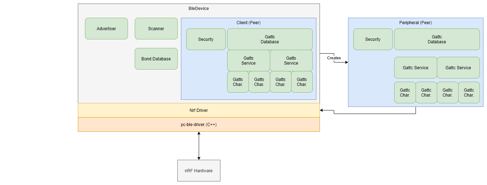

Library Architecture
====================

Class Hierarchy (WIP)
---------------------

Very high-level diagram outlining major/public components

**BleDevice**

The :class:`~blatann.device.BleDevice` class represents the Nordic hardware itself and is the primary entry point for the library.
It provides the high-level APIs for all BLE operations, such as advertising, scanning, and connections.
It also manages the device's configuration and bonding database.

**Advertiser**

The :class:`~blatann.gap.advertising.Advertiser` class provides the API for
setting advertising data, intervals, and starting/stopping of advertising.
It is accessed via BleDevice.:attr:`~blatann.device.BleDevice.advertiser` attribute.

**Scanner**

The :class:`~blatann.gap.scanning.Scanner` class provides the API for scanning for advertising packets.
Scan reports are emitted during scanning and can be used to initiate connections with the advertising peripherals.
It is accessed via BleDevice.:attr:`~blatann.device.BleDevice.scanner` attribute.

**Peer**

The :class:`~blatann.peer.Peer` class represents a connection with another device over Bluetooth. The BLE Device
contains a single :class:`~blatann.peer.Client` object, which is the connection with a Client/Central device.
When connecting to Server/Peripheral devices as a Client/Central via :meth:`BleDevice.connect() <blatann.device.BleDevice.connect>`,
a :class:`~blatann.peer.Peripheral` object is created and returned as a result of the ``connect()`` call.

The Peer object provides everything necessary for communications with the device, including security,
database creation (as a server) and discovery (as a client), connection parameters, etc.

Threading Model
---------------

Most BLE operations are inherently asynchronous. The Nordic has a combination of synchronous function calls and asynchronous
events. Synchronous function calls may not return the result immediately and instead return within an asynchronous event
as to not block the main context.

Blatann uses a second python thread for handling asynchronous events received over BLE.
This event thread (named ``"<comport>Thread"``) handles a queue of events received from the C++ Driver
and dispatches them to the registered callbacks. These callbacks are the triggers for the various :class:`~blatann.event_type.Event`
objects that exist throughout the ``Peer``, ``Scanner``, ``Advertiser``, and other objects.

In order to support both both event-driven and procedural styles of programming, a mechanism needs to exist in order to
communicate events back to the main thread so asynchronous functionality (such as characteristic reads/writes)
can be made synchronous. The result of this is the :class:`~blatann.waitables.waitable.Waitable` class.

Asynchronous method calls in the library will return a ``Waitable`` object which can either then have callbacks registered (to keep things asynchronous)
or waited on (with or without timeout) from the main thread to make it synchronous.
Additionally, it can be awaited on for use with ``asyncio``.

This is a very similar concept to
:class:`concurrent.futures.Future <python:concurrent.futures.Future>`, just a different implementation.

Since there is only a single thread which handles all events,
**do not call** :meth:`Waitable.wait() <blatann.waitables.waitable.Waitable.wait>` **within an event handler as it will cause a deadlock.**
Calling BLE methods from the event handler context is perfectly fine and can use
:meth:`Waitable.then(callback) <blatann.waitables.waitable.Waitable.then>` to handle the result of the operation asynchronously.
